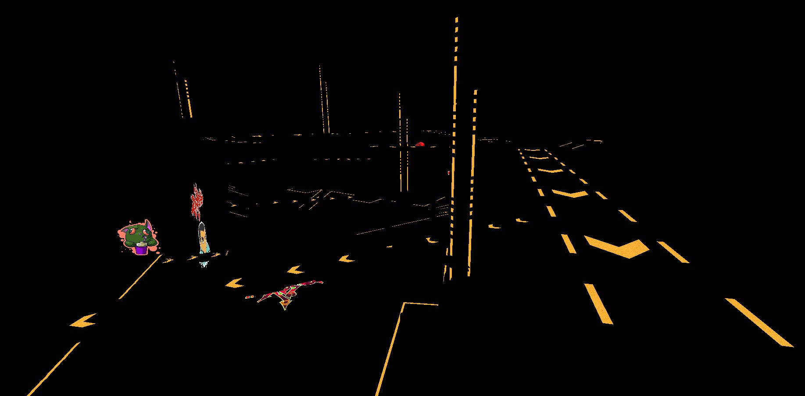

# Efficient Shading

by [Chosko](https://chosko.com)

<!-- <span class="font-size-40">You can now [Download the Unity Demo](shader-intro-demo.unitypackage) presented during the lesson</span> -->

Note:

Cosa?

* Tecniche utilizzate in videogiochi con grafica HQ
* No Stato dell'arte senza ottimizzazione di rendering
    * A livello di pipeline di rendering!

Come?

* Nelle aziende più grandi motori custom
* Da noi Unity le fornisce grazie a dei plugin

------------

## Summary

* **Forward Shading**
* Deferred Shading
* Decal Rendering
* Tiled/Clustered Shading
* Clustered Shading

------------

# Forward Shading

Note:

Prima di parlare delle tecniche di shading efficiente, facciamo un passo indietro. Il forward shading è la modalità standard di rendering.

---

## Forward Shading


Note:

Ogni frame è renderizzato un oggetto alla volta. I pixel di un oggetto appena renderizzato vanno a sovrapporsi al resto del frame che è stato renderizzato finora.

Una volta che il frame è pronto viene mostrato a schermo.

---

## Forward Shading

We have always used it 

<ul class="fragment">
    <li>Blind</li>
    <li>Omen</li>
    <li>Almost everything else we made</li>
</ul>

---

## Forward Shading

It uses the **standard GPU pipeline**.


<p class="fragment">
Let's quickly review it
</p>

Note:

Rivediamo velocemente come funziona la pipeline.

---

### Vertex shader


Transforms the vertices of a mesh from **object space** to **clip space**

---

### Vertex shader


---

### Vertex post-processing


**Clips vertices** outside of the clip volume and **transforms** them from **clip space** to **screen space**

---

### Vertex post-processing


---

### Primitive assembly


Organizes vertices in **primitives** (usually triangles)

---

### Rasterization


Transforms **vector graphics** into **raster graphics**: triangles to fragments (pixels).

---

### Rasterization


---

### Fragment Shader


<span class="fragment">Gives a **color** and a **depth** to each fragment</span>

---

### Fragment Shader


Typical operations on a FS

* Texturing
* Lighting
* Normal mapping
* Reflections, refractions
* A ton of other techniques

<p class="fragment">It usually takes **most of the rendering time**</p>

---

### Fragment Operations


It's a stage made of some sub-stages


---

## Forward shading 

It's good for

<ul>
    <li class="fragment">Simple scenes</li>
    <li class="fragment">Little geometry</li>
    <ul class="fragment">
        <li>
            Due to **overdraw** it's easy to waste GPU time by shading invisible pixels.
        </li>
    </ul>
    <li class="fragment"><span class="highlight">**Few lights**</span></li>
    <ul class="fragment">
        <li>
            Lighting computations are usually the most expensive on GPU!
        </li>
    </ul>
</ul>

---

### Overdraw


---

### Overdraw


Note:

È possibile ottimizzare limitando l'overdraw?

---

### Overdraw

<ul>
    <li class="fragment">We can *limit* overdraw, but we will always deal with it.</li>
    <li class="fragment">All the surfaces covered are still being rendered and **shaded**.</li>
    <li class="fragment">What if we can **shade** only the visible pixels?</li>
</ul>

<p class="fragment">Let's see some approaches...</p>

---

### Overdraw

Disabling non-adjacent rooms


---

### Overdraw

**Occlusion culling**


---

### Overdraw

**Occlusion culling**

<ul>
    <li class="fragment">It **trades** GPU time for CPU time</li>
    <li class="fragment">It's great in some cases</li>
    <ul class="fragment">
        <li>Closed spaces</li>
        <li>Rooms</li>
        <li>Scenes with many big objects or walls</li>
    </ul>
    <li class="fragment">The convenience also depends on the hardware</li>
    <ul class="fragment">
        <li class="fragment">We had to disable it on PS4</li>
    </ul>
</ul>

---

### Overdraw

**Early fragment test**


<ul>
    <li class="fragment">It gets enabled automatically as an optimisation</li>
    <li class="fragment">The benefit depends on the **rendering order**!</li>
</ul>

---


### Overdraw

**Depth prepass**

<ul>
    <li class="fragment">It pre-renders **the whole scene** using replacement shaders</li>
    <ul>
        <li class="fragment">Vertex shader is super simple</li>
        <li class="fragment">Fragment shader is empty</li>
        <li class="fragment">It writes **depth** but **no color**</li>
    </ul>
    <li class="fragment">During render, the depth of the whole scene is already present</li>
    <li class="fragment">Combined with **Early fragment test** it completely removes overdraw (on opaque objects)</li>
</ul>

---

### Overdraw

**Depth prepass**

<ul>
    <li class="fragment">It's good when:</li>
    <ul>
        <li class="fragment">You have much overdraw</li>
        <li class="fragment">Your fragment shaders are heavy</li>
    </ul>
    <li class="fragment">It's bad when:</li>
    <ul>
        <li class="fragment">You have a large number of small objects (it doubles draw calls)</li>
        <li class="fragment">Your geometry is too dense of vertices (it doubles vertex shader time)</li>
    </ul>
</ul>

---

### Many lights

<ul>
    <li class="fragment">In a fragment shader, usually the **lighting computations** are the most expensive</li>
    <li class="fragment">The number of active lights drastically affects performances</li>
</ul>

---


---

### Many lights

**Multi pass shader**

<ul>
    <li class="fragment">In Unity, each light is computed in a different **pass**</li>
    <li class="fragment">Bad for geometry. Especially on skinned meshes.</li>
    <li class="fragment">Let's see another approach...</li>
</ul>

---

### Many lights

**Single pass shader**

<ul>
    <li class="fragment">A custom shader manages all the lights in a single pass (Blind!)</li>
    <li class="fragment">Much harder to mantain</li>
    <li class="fragment">Better for geometry</li>
</ul>

---

### Many lights

**Single pass shader**

```
// ...

// Calculate the lighting for 4 lights. Params are ordered by feature. Mandatory params are at bottom (to avoid trailing comma).
inline void Calc4Lights ()
{

    // ...

}

// Vertex shader
Varys ComputeBlindVertex(){

  // ...

}

// Fragment shader
float4 ComputeBlindFragment(){

  // ...

  // If at least one light is on, make a lot of computations
  #ifndef TBS_LIGHTS_OFF

  // ...

  // Compute lights 1-4
  #if defined ( TBS_LIGHTS1_ON ) ||  defined ( TBS_LIGHTS2_ON ) ||  defined ( TBS_LIGHTS3_ON ) ||  defined ( TBS_LIGHTS4_ON )
    Calc4Lights ();
  #endif

  // Compute lights 5-8
  #if defined ( TBS_LIGHTS2_ON ) ||  defined ( TBS_LIGHTS3_ON ) ||  defined ( TBS_LIGHTS4_ON )
    Calc4Lights ();
  #endif

  // Compute lights 9-12
  #if defined ( TBS_LIGHTS3_ON ) ||  defined ( TBS_LIGHTS4_ON )
    Calc4Lights ();
  #endif

  // Copute lights 13-16
  #if defined ( TBS_LIGHTS4_ON )
    Calc4Lights ();
  #endif

  // ...

  #endif

  // ...

}
```

---

### Many lights

**Frustum culling**


---

### Many lights

<ul>
    <li class="fragment">All the previous approaches use a **global list** of lights</li>
    <li class="fragment">Lights far away from an object get always computed</li>
    <li class="fragment">We could make **per-object lists**</li>
    <ul>
        <li class="fragment">It greatly reduces GPU time</li>
        <li class="fragment">It badly increases CPU time: we have to update the lists!</li>
    </ul>
</ul>

---

## Forward shading

We can push optimisation a lot with **forward shading**, but we will always have to deal with a **small number of lights** and an overhead due to **overdraw** or other techniques implemented to reduce the latter.  

------------

## Summary

* Forward Shading
* **Deferred Shading**
* Decal Rendering
* Tiled/Clustered Shading

------------

# Deferred shading

---

## Deferred shading

<p class="fragment">
The idea is to perform all *visibility testing* and *surface property* evaluation **before** performing any *material lighting* computation. We have:
</p>

<ul>
    <li class="fragment">A **geometry pass** that generates and stores all the material parameters into some buffers (the G-buffers)</li>
    <li class="fragment">A **lighting pass** that computes the lights using the G-buffers as textures. 
</ul>

---

### The geometry pass

This pass is made using a technique called **Multiple Render Targets** (MRT).

<p class="fragment">MRT allows a fragment shader to target more than one texture</p>


---

#### G-Buffer 0


---

#### G-Buffer 1


---

#### G-Buffer 2


---

#### G-Buffer 3


---

#### Depth Buffer


---

#### Stencil Buffer


---

#### Velocity Buffer


---

### The geometry pass

<ul>
    <li>The G-Buffers layout is configurable</li>
</ul>


---

### The geometry pass

**Pros**

<ul>
    <li class="fragment">After this pass we don't need the geometry anymore</li>
    <li class="fragment">We have **overdraw**, but the shader is much faster</li>
    <li class="fragment">We have **deferred** the expensive lighting computations</li>
</ul>

---

### The geometry pass

**Cons**

<ul>
    <li class="fragment">High G-buffer video memory usage</li>
    <li class="fragment">High memory bandwith costs</li>
    <li class="fragment">No support for transparent materials</li>
    <li class="fragment">No MSAA</li>
</ul>

---

### The lighting pass

<ul>
    <li class="fragment">It renders a full-screen quad for each light</li>
    <li class="fragment">The fragment shader:</li>
    <ul>
        <li class="fragment">Uses the G-Buffers as textures mapped on the quad</li>
        <li class="fragment">Computes the lighting of the whole scene all at once</li>
    </ul>
    <li class="fragment">The results of each light are blended together</li>
</ul>

---

### The lighting pass

**Pros**

<ul>
    <li class="fragment">Only **one draw call** per light</li>
    <li class="fragment">Almost no geometry (a quad per light)</li>
    <li class="fragment">We completely **removed overdraw**</li>
</ul>

---

### The lighting pass

**Cons**

<ul>
    <li class="fragment">Only few lights</li>
</ul>

<p class="fragment">We will come back to this later...</p>

------------

## Summary

* Forward Shading
* Deferred Shading
* **Decal Rendering**
* Tiled/Clustered Shading

------------

# Decal Rendering

---

## Decal Rendering

A **decal** is a texture applied on top of a surface.

<ul class="fragment">
    <li>Tire marks</li>
    <li>Bullet holes</li>
    <li>Tags</li>
    <li>Variations (e.g. dirty walls)</li>
</ul>

---

## Decal Rendering

A **decal** can:

<ul class="fragment">
    <li>Modify the underlying color</li>
    <li>Replace the normal mapping</li>
    <li>Define a completely different material</li>
</ul>

<p class="fragment">
A **decal** must be mapped to the surface. There are several approaches...
</p>

---

## Decal Rendering

**Mapping decals as textures**

<ul>
    <li class="fragment">We have a limited amount of UV sets</li>
    <li class="fragment">Many small decals means saving UVs at every vertex while each decal affects few triangles</li>
    <li class="fragment">The fragment shader: </li>
    <ul>
        <li class="fragment">Samples all the decals</li>
        <li class="fragment">Blends them one atop the next</li>
        <li class="fragment">Gets much complicated</li>
        <li class="fragment">Must be compiled many times (number of decals may vary)</li>
    </ul>
</ul>

---

## Decal Rendering

**Duplicating geometry**

<ul>
    <li class="fragment">Render the mesh again for each decal</li>
    <li class="fragment">It can drastically increase the rendered geometry</li>
    <li class="fragment">We can create smaller sub-meshes</li>
    <li class="fragment">It's what Unity does with forward shading</li>
</ul>

---

## Decal Rendering

**Baking decals onto textures**

<ul>
    <li class="fragment">Bad texture and memory management</li>
</ul>

---

## Decal Rendering

**Volume projectors**

<ul>
    <li class="fragment">The decal is **orthographically projected** through a box</li>
    <ul>
        <li class="fragment">The faces of the box are rasterized</li>
        <li class="fragment">Surface's depth and screen position converted into a location in the volume</li>
        <li class="fragment">This gives textures coordinates</li>
    </ul>
</ul>

---

## Decal Rendering

**Volume projectors**


---

## Decal Rendering

**Volume projectors**

These decals are perfect for **Deferred shading**

<ul>
    <li class="fragment">They can directly modify the G-Buffers</li>
    <li class="fragment">Or they can be stored on a D-Buffer</li>
    <li class="fragment">No need to illuminate each decal</li>
    <li class="fragment">No overdraw</li>
    <li class="fragment">Decals not needed during shading</li>
</ul>

---

## Decal Rendering



------------

## Summary

* Forward Shading
* Deferred Shading
* Decal Rendering
* **Tiled/Clustered Shading**

------------

## Tiled/Clustered Shading

---

## Tiled Shading

The screen is divided into **small tiles**

<ul>
    <li class="fragment">Each tile keeps a **list of lights**</li>
    <li class="fragment">The lighting pass evaluates each tile separately</li>
    <ul>
        <li class="fragment">A light is evaluated only on few tiles</li>
        <li class="fragment">It drastically increases the number of lights allowed</li>
    </ul>
</ul>

---

## Tiled Shading

It's made with **frustum culling** made on many small frustums.


---

## Tiled Shading

It's awesome, but we can do better.

<ul>
    <li class="fragment">Some lights fall inside the frustum but don't hit any geometry</li>
    <li class="fragment">What if we divide also the depth?</li>
</ul>

---

## Clustered Shading

The view frustum is divided into **small volumes (clusters)**

<ul>
    <li class="fragment">The **tiling** divides the frustum horizontally and vertically</li>
    <li class="fragment">The **clustering** divides also the tiles along their depth</li>
    <li class="fragment">Each **cluster** keeps its **list of lights**</li>
    <li class="fragment">It culls out lights that don't hit any geometry in a given tile</li>
</ul>

---

## Clustered Shading


---

## Clustered Shading


---

## Clustered Shading


---

## Clustered Shading


---

## Clustered Shading


---

## Some useful info


------------

## Efficient shading in Unity

[Scriptable Rendering Pipeline](https://github.com/Unity-Technologies/ScriptableRenderPipeline)

------------

## Further reading

<ul class="font-size-80">
    <li>Rendering Pipeline</li>
        <ul>
            <li>Mathematics for 3D Game Programming and Computer Graphics - Third Edition - Eric Lengyel - Chapter 1</li>
            <li>[Shader Intro](https://shader-intro-slides.chosko.com)</li>
            <li>[My thesis](https://www.dropbox.com/s/egvywh1eayqken3/thesi s.pdf?dl=0) - Chapter 2 </li>
        </ul>
    </li>
    <li>Efficient Shading</li>
        <ul>
            <li>Real-Time Rendering - Fourth Edition - T. Akenine-Moller, E. Haines, N. Hoffman, A. Pesce, M. Iwanicki, S. Hillaire - Chapter 20</li>
        </ul>
    </li>
</ul>
